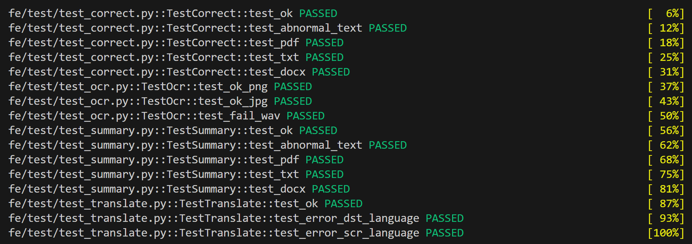
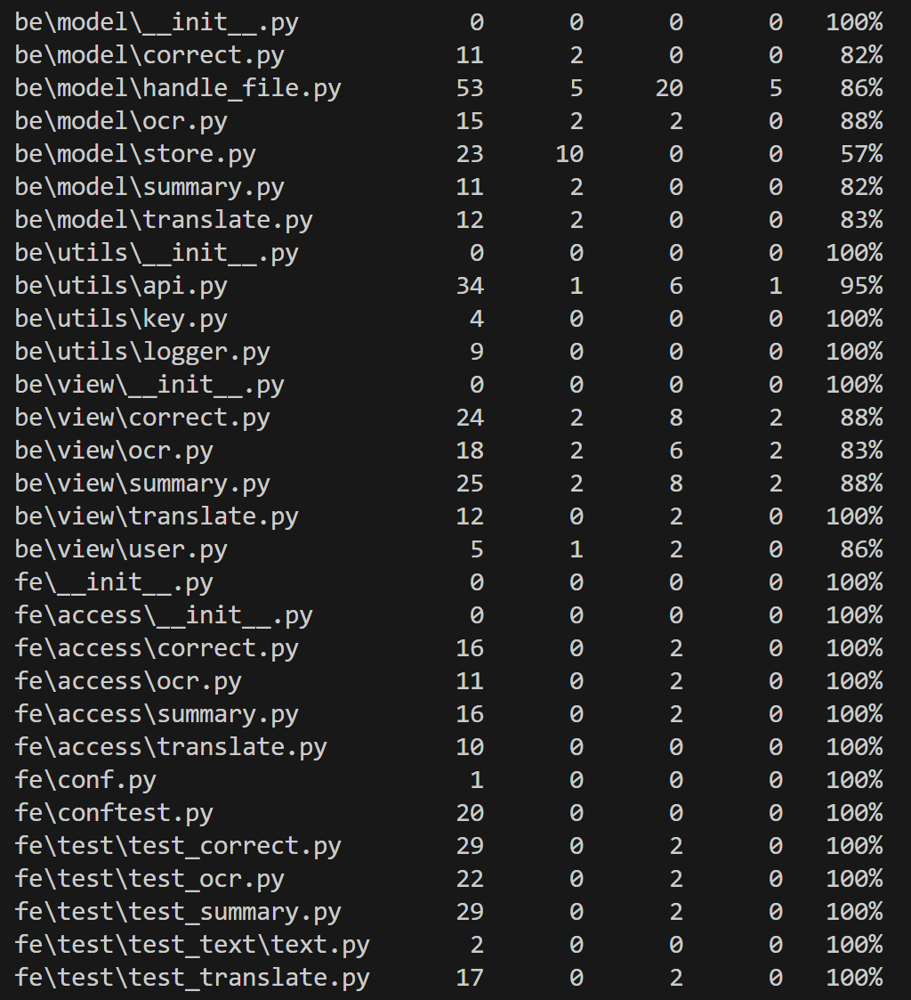

# 测试文档
## 使用工具 pytest
### test_correct 测试校对功能
test_ok 测试正常文本  
test_abnormal_text 测试不通顺文本
test_pdf 测试读入pdf
test_txt 测试读入txt  
test_docx 测试读入docx

### test_ocr 测试图片转文字
test_ok_png 测试png格式  
test_ok_jpg 测试jpg格式
test_fail_wav 测试错误的wav格式

### test_summary 测试摘要功能
test_ok 测试正常文本  
test_abnormal_text 测试不通顺文本
test_pdf 测试读入pdf
test_txt 测试读入txt  
test_docx 测试读入docx

### test_translate 测试翻译功能
test_ok 测试多语言翻译
test_error_language 测试设置错误的翻译语言

## 测试结果

